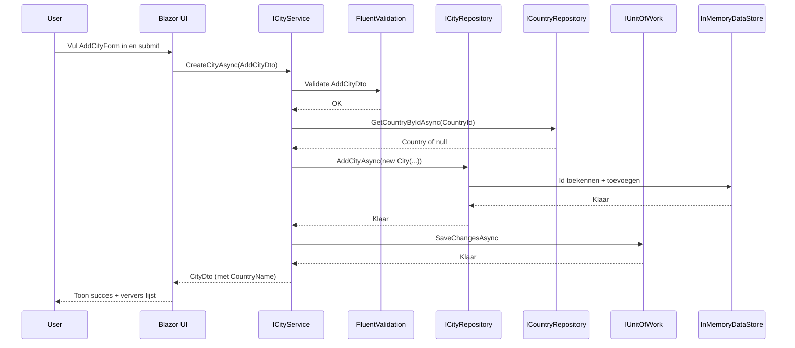
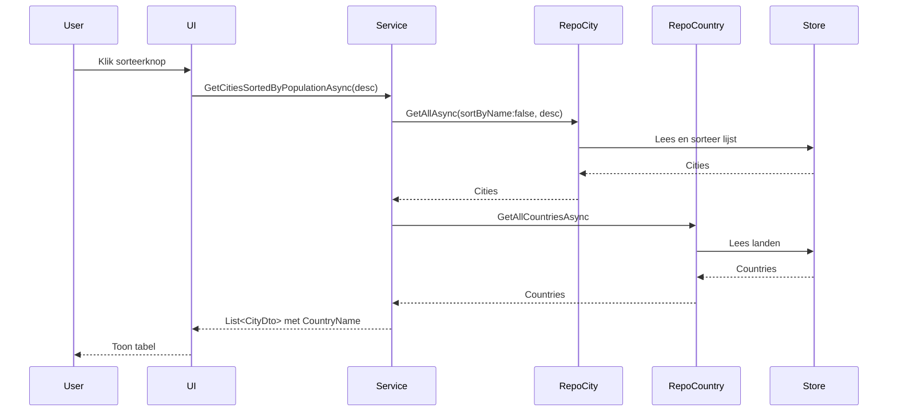

# Demo app voor Applied Software Project

Dit project is een demo die laat zien hoe je Clean Architecture toepast met vier lagen (Domain, Application, Infrastructure, Presentation), zonder database (we gebruiken een in‑memory data store). De app toont steden, laat je sorteren op aantal inwoners en laat je een nieuwe stad toevoegen met validatie.

## Wat doet deze demo?
- Steden tonen met hun land en aantal inwoners.
- Sorteren op aantal inwoners (laag → hoog of hoog → laag).
- Een nieuwe stad toevoegen via een formulier met validatie en duidelijke foutmeldingen.
- Alles draait lokaal in geheugen; dus geen database nodig om te testen.

## Clean Architecture (overzicht)
Doel: verantwoordelijkheden scheiden, afhankelijkheden beheersen en je core‑logica onafhankelijk houden van UI of opslag.

Lagen en rollen:
1) Domain (AP.CityDataDemo.Domain)
   - Kern van je business: Entities (City, Country) en basisinvarianten (regels die altijd gelden).
   - Voorbeeld: City garandeert dat naam niet leeg is en populatie niet negatief.
   - Kent geen andere lagen (maximale onafhankelijkheid).
2) Application (AP.CityDataDemo.Application)
   - Use‑cases en validatie per scenario (Create/Update), Data Transfer Objects (DTOs), services en interfaces.
   - Kent Domain, maar niet Infrastructure of Presentation.
3) Infrastructure (AP.CityDataDemo.Infrastructure)
   - Technische implementaties: in‑memory data, repositories, seeding en Unit of Work.
   - Implementeert interfaces uit Application.
4) Presentation (AP.CityDataDemo.Presentation)
   - De UI (Blazor Components). Roept services uit Application aan en toont resultaten.

Afhankelijkheden: Presentation → Application → Domain. Infrastructure implementeert Application‑interfaces. Domain kent niemand.

### Architectuurdiagram
```mermaid
flowchart TB
  UI[Presentation (Blazor UI)] --> App[Application (Services, Validators, DTOs)]
  App --> Domain[Domain (Entities, Rules)]
  App --> Infra[Infrastructure (Repositories, UoW, Data Seeder)]
  Infra --> Data[(InMemoryDataStore)]
```

## Belangrijkste onderdelen (in gewone taal)
- Domain
  - City, Country: echte businessobjecten met basisregels (invarianten).
  - IEntity: markeert dat een object een Id heeft.
- Application
  - DTOs: AddCityDto (input van gebruiker), CityDto (wat UI toont), CountryDto.
  - Validation (FluentValidation): AddCityDtoValidator en CityDtoValidator met regels zoals naam niet leeg/max 100, population 0..50.000.000, land bestaat, naam uniek (bij create).
  - Services: CityService is de regisseur; voert validatie uit, praat met repositories, zet domeinobjecten om naar DTO’s.
  - Interfaces: ICityRepository, ICountryRepository, IGenericRepository, IUnitOfWork, IDataSeeder.
  - Mappings: CityMapper zet City ↔ CityDto om.
- Infrastructure
  - InMemoryDataStore: lijstjes voor landen en steden, plus Id‑uitdeling.
  - DataSeeder: vult landen en steden bij het opstarten.
  - Repositories: CityRepository en CountryRepository (en GenericRepository) voeren data‑operaties uit op de in‑memory lijsten.
  - UnitOfWork: modelleert "opslaan" (nu conceptueel/no‑op), zodat je later makkelijk naar een DB kan.
- Presentation (Blazor UI)
  - Cities.razor: pagina met tabel, sorteerknoppen en knop om het formulier te tonen.
  - AddCityForm.razor: formulier om een stad toe te voegen. Toont validatiefouten en succesboodschappen.
  - Program.cs: start de app, registreert services, repositories, validators en seeding.

## Data Flow in Detail: Van Request tot Response

Om te begrijpen hoe de lagen samenwerken, volgen we de reis van een typisch gebruikersverzoek. We gebruiken "een nieuwe stad toevoegen" als voorbeeld.

### 1. De Gebruiker Interageert met de **Presentation Layer**
Alles begint in de browser van de gebruiker.

-   **`AddCityForm.razor`**: De gebruiker vult het formulier in om een nieuwe stad toe te voegen en klikt op "Opslaan". Dit component verzamelt de input van de gebruiker in een `AddCityDto` object.
-   **`Cities.razor`**: Deze pagina, die het formulier bevat, roept de `CreateCityAsync` methode aan op de application service en geeft de `AddCityDto` door.

### 2. De Request Gaat naar de **Application Layer**
De `ICityService` fungeert als het centrale toegangspunt voor de applicatielogica.

-   **`ICityService`**: Dit is het contract. De presentation layer kent alleen deze interface, niet de concrete implementatie.
-   **`CityService`**: Deze klasse ontvangt de `AddCityDto`. Zijn eerste taak is het orkestreren van de use case:
    1.  **Validatie**: Het controleert de input (is de naam niet leeg? Is de populatie binnen de grenzen? Bestaat de stadsnaam al?).
    2.  **Orkestratie**: Als de validatie slaagt, coördineert het met de repositories. Het vraagt bijvoorbeeld aan de `ICountryRepository` of het geselecteerde land bestaat.
    3.  **Aanroepen van Domeinlogica**: Het creëert een nieuwe `City` domein-entiteit. Dit is een cruciale stap waarbij de eigen regels van het domein worden afgedwongen (de `City` constructor gooit een exception als de naam ongeldig is).
    4.  **Persistentie**: Het geeft de `ICityRepository` de opdracht om de nieuwe `City` entiteit op te slaan.
    5.  **Transactiebeheer**: Het roept `SaveChangesAsync()` aan op de `IUnitOfWork` om de transactie (conceptueel) te committen.

### 3. De Kernlogica wordt afgehandeld door de **Domain Layer**
Deze laag wordt niet direct aangeroepen, maar de objecten ervan worden gecreëerd en gebruikt.

-   **`City` (Entity)**: Wanneer de `CityService` `new City(...)` uitvoert, valideert de constructor van de `City` entiteit onmiddellijk zijn eigen staat. Dit zorgt ervoor dat er nooit een ongeldige stad kan worden aangemaakt. Dit is de kern van het beschermen van je business-regels.

### 4. Implementatiedetails worden beheerd door de **Infrastructure Layer**
De application layer is afhankelijk van abstracties (`ICityRepository`, `IUnitOfWork`), en deze laag levert de concrete implementaties.

-   **`CityRepository`**: Deze klasse implementeert `ICityRepository`. Wanneer zijn `AddCityAsync` methode wordt aangeroepen, interacteert het met de databron.
-   **`InMemoryDataStore`**: De repository voegt het nieuwe `City` object toe aan de `List<City>` die door deze singleton klasse wordt bijgehouden. Het wijst ook een nieuw ID toe. Deze klasse fungeert als onze database.
-   **`UnitOfWork`**: De `SaveChangesAsync` methode wordt aangeroepen. In dit project doet deze niets omdat er geen echte databasetransactie is. Het patroon is echter aanwezig, wat een toekomstige overstap naar een echte database veel eenvoudiger maakt.

### 5. De Response Stroomt Terug
Zodra de data is opgeslagen, keert de stroom om:

1.  De `UnitOfWork` en `CityRepository` voltooien hun taken.
2.  De `CityService` gebruikt een mapper (`CityMapper`) om de nieuw aangemaakte `City` entiteit terug te converteren naar een `CityDto`.
3.  Deze `CityDto` wordt geretourneerd aan de **Presentation Layer** (`Cities.razor`).
4.  De UI wordt bijgewerkt om de nieuwe stad in de lijst te tonen en een succesbericht weer te geven.

Deze hele stroom zorgt ervoor dat afhankelijkheden naar binnen wijzen (richting het Domein) en dat elke laag een duidelijke, enkele verantwoordelijkheid heeft.


## Features (2 voorbeelden)
1) Steden bekijken en sorteren
   - UI vraagt via ICityService steden op, met sorteerkeuze.
   - CityRepository haalt steden uit memory en sorteert.
   - CityService vult landnamen aan en mapt naar CityDto’s.
   - UI toont de tabel.

2) Nieuwe stad toevoegen
   - UI toont AddCityForm en laadt landen voor de dropdown.
   - Bij opslaan valideert Application (FluentValidation): naam, lengte, population, land bestaat, naam uniek.
   - Domain (City) garandeert basisregels (als extra vangnet).
   - Repository voegt de stad toe en kent een nieuwe Id toe; UnitOfWork "committ" wijzigingen (conceptueel).
   - Service retourneert CityDto; UI toont succes en ververst de lijst.

## End‑to‑end flows
### Stad toevoegen (Create)


### Sorteren op aantal inwoners


## Waarom DTO’s en Unit of Work?
- DTO’s geven de UI precies de data die nodig is en houden Domain gescheiden van Presentation.
- Unit of Work is nu conceptueel (in‑memory), maar maakt de stap naar een echte database later eenvoudig zonder je businesslogica te wijzigen.

## Validatie: waar leven de regels?
- Domain (City): ononderhandelbare basisregels (naam niet leeg, population >= 0, CountryId > 0).
- Application (FluentValidation): use‑case regels (naam uniek, land bestaat, maxlengte, limieten) vóór de operatie.
- Presentation (UI): DataAnnotations voor directe gebruikersfeedback; toont ook validator-/domainfouten die uit de service komen.

## Samenvatting in 1 minuut
- UI vraagt iets aan (lezen/sorteren/toevoegen).
- Application Service valideert en orkestreert.
- Repositories praten met de in‑memory data store.
- Domain zorgt dat objecten nooit in een ongeldige staat komen.
- Resultaten gaan als DTO’s terug naar de UI.

---

## Validatiekaart (snelle referentie)
- Domain (Entities/ValueObjects)
  - City: Name niet leeg/whitespace; Population >= 0; CountryId > 0.
- Application (Validators/Use-cases)
  - AddCityDtoValidator: Name verplicht en ≤ 100; Population 0..50.000.000; CountryId > 0; land bestaat; naam uniek.
  - CityDtoValidator: zelfde syntactische regels; land bestaat.
  - Services: vertalen not‑found naar NotFoundException.
- Presentation (UI/DataAnnotations)
  - UX‑validatie en tonen van ValidationException/NotFoundException.

## Afspraken (korte checklist)
- Population is overal int (0..50.000.000).
- Id’s worden in-memory toegekend (GetNext...Id), ook bij bulk‑adds.
- Repositories geven bool terug bij Update/DeleteById; services handelen not‑found af.
- Unit tests dekken validators en services (happy path en foutpaden).